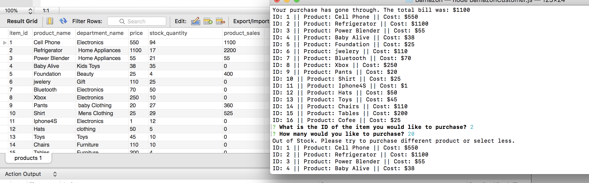

# Bamazon

This is a storefront Node App which have thwo interfaces:
* Customer Interface 
* Manager Interface

### Customer Interface
Customer Interface is obtained by running bamazonCustomer.js file in Node terminal. When application is run for the first time, it will display all the items available for sale with its ids, names and prices. The user is prompted with two messages, first is the ID of the product thay would like to purchase and the second is how much of that particular product are they willing to purchase. Once the user placed an order it will display the purchased total. Also if Customer order more quantity then in the stock, it display message with "Out of Stock Please purchase differnet product or purchase less". 

### Manager Interface
Manager Inerface is obtained by running bamazonManager.js file in Node terminal. When application is run for the first time, it will display
* View Product for Sale
* View Low Inventory
* Add to Inventory
* Add New Product

#### View Product for Sale
Manager is able to view the list of the product for Sale. List incuded Id, name and price of the product as well as stock quantity.

#### View Low Inventory
Manager is able to view the products that are less then 5 in stock which considered as low in Inventory and able to add more in the stock.

#### Add to Inventory
Manager is able to add products and update the stock.

#### Add New Product
Manager is able to add completely new product with the product id, name, department, stock quantity. Added product is updated in the database and available for customers to purchase.

